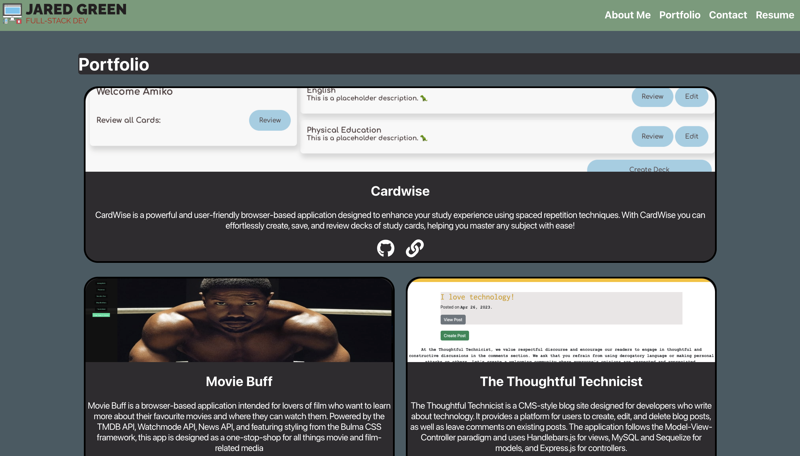
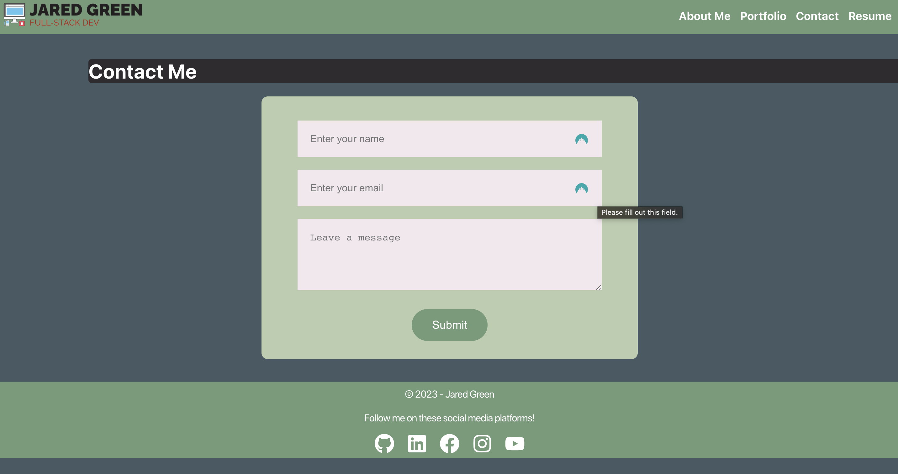
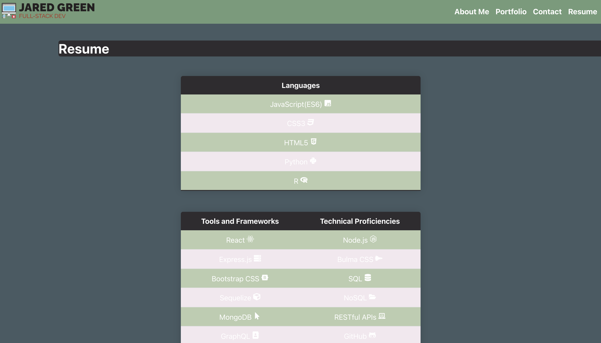

# Webscribe

A professional portfolio created using react. 

## Table of Contents
- [Screenshots](#screenshots)
- [Description](#description)
- [Installation](#installation)
- [Usage](#usage) 
- [License](#license)

## Screenshots 

## Description

Welcome to my portfolio! I am Jared Green, a Full-Stack Web Developer based in New Brunswick. My passion for stylish and resource-efficient applications has led me to specialize in a range of technologies.

This portfolio is a curated showcase of my work in web development, highlighting projects that best reflect my skills and experiences in this field. My journey has taken me from studying psychology to a Full-Stack Web Development certificate from the University of New Brunswick. Here, you'll find applications that combine clean code, intuitive design, and practical problem-solving solutions.

My background in psychology informs my approach to web development, instilling in me a user-centric perspective and a dedication to accessibility. Through this portfolio, you'll get a sense of my adaptability, my attention to detail, and my commitment to continual learning, all of which I bring to every project I undertake.

I am particularly proud of the projects presented here as they demonstrate a wide range of proficiency in both front and back end technologies. Each project included has been an opportunity to explore and apply new tools and methodologies.

Feel free to explore and reach out if you have any questions or would like to discuss opportunities to collaborate. I am always open to new challenges and looking forward to helping bring your next project to life!

My React portfolio has been delpoyed via GitHub Pages and can be visited [here](https://pilotguide9897.github.io/RadioReactive/#).

## Installation

This application is deployed through GitHub Pages, no installation is necessary to view this site.

## Usage
Viewers of this portfolio may navigate the application using the tabs in the top-right corner to switch between sections about me, my past and current projects, a form for contacting me with questions or comments, and a page outlining my technical competencies. As a typical portfolio, this deployment is primarily a read-only site and features minimal user interaction.

## Plans for Future Development
As my skills with front-end development grow, I plan to continue to update and expand this portfolio to better demonstrate what I am capable of as a developer. As it stands, this portfolio represents a rought product that has significant room for improvement.

## Questions
If you have any questions concerning this application, do not hesitate to reach me at jaredryan1997@hotmail.com. You may also view my GitHub profile at http://github.com/Pilotguide9897.

## License
This project is licensed under the . See the [license](https://opensource.org/licenses/MIT) documentation for more information.
